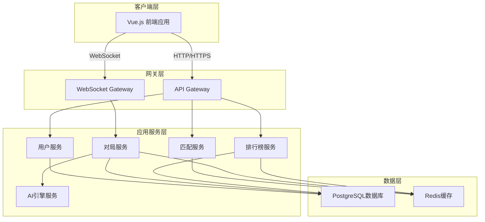
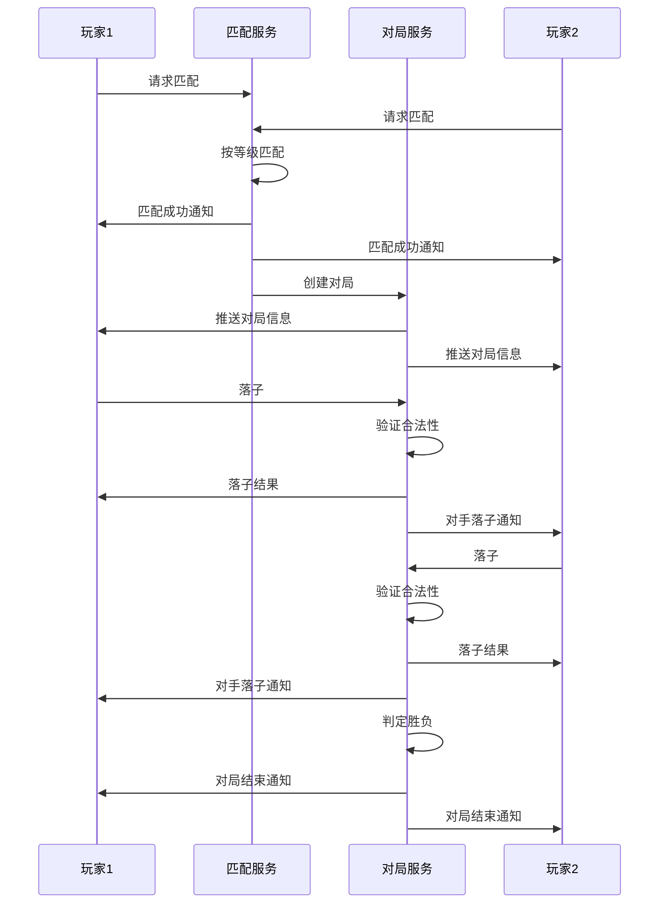
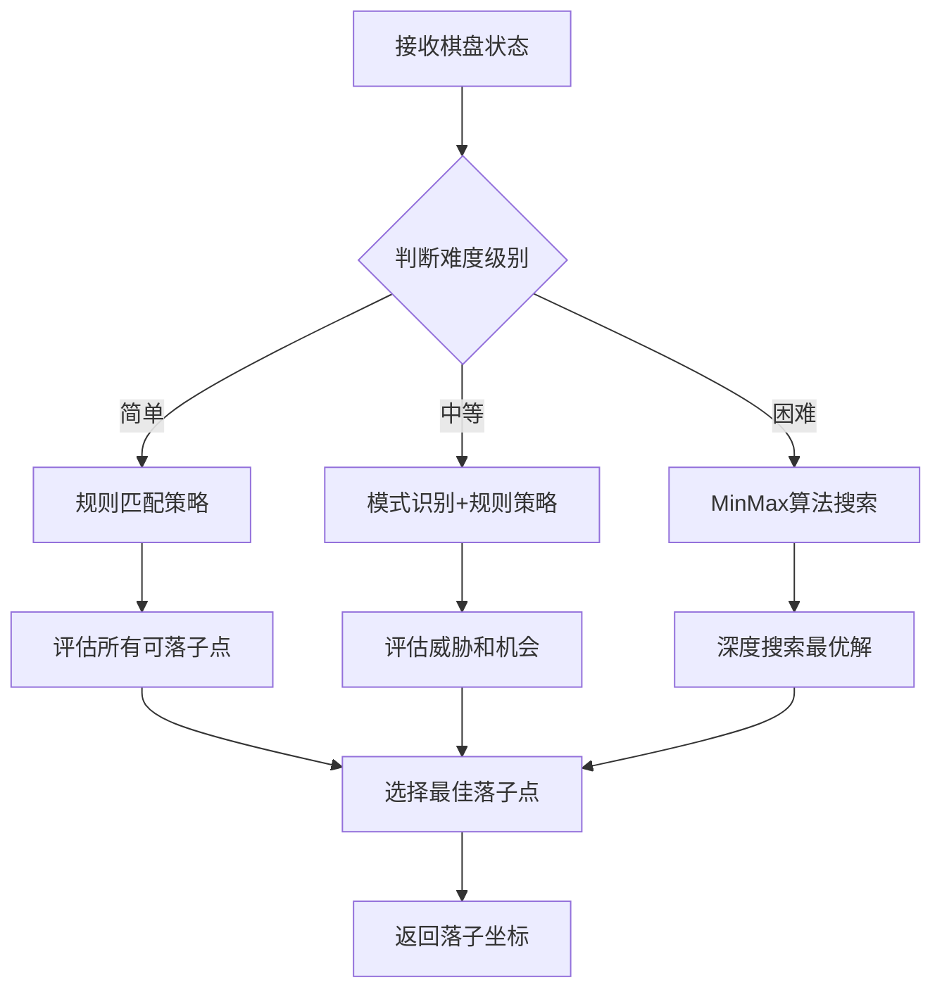
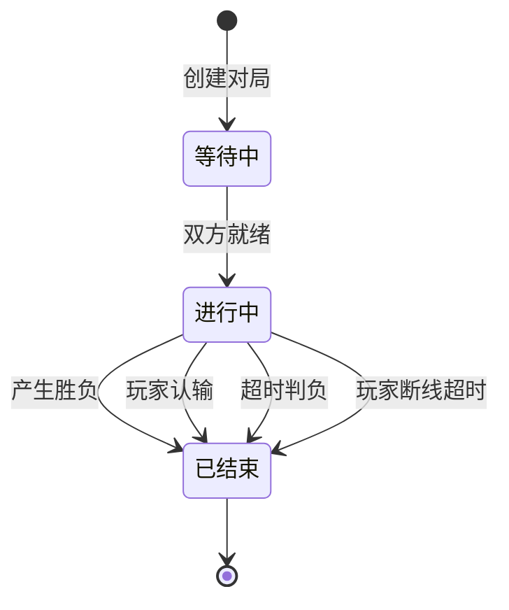
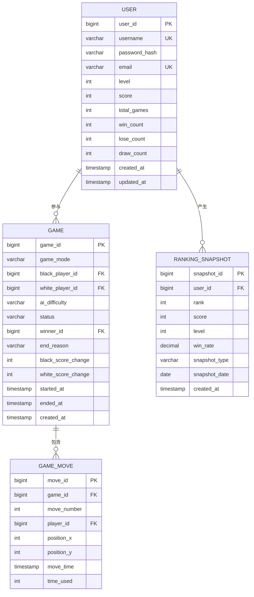
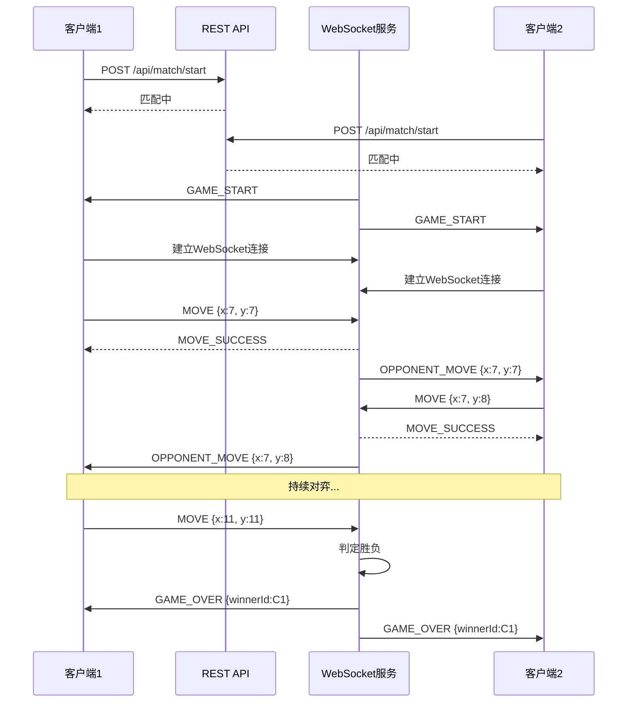
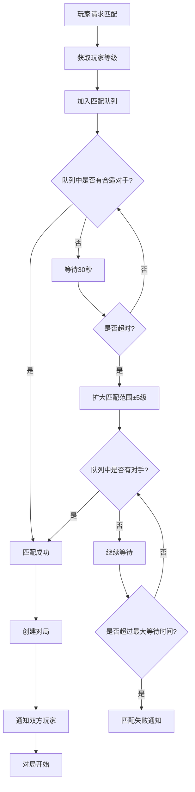
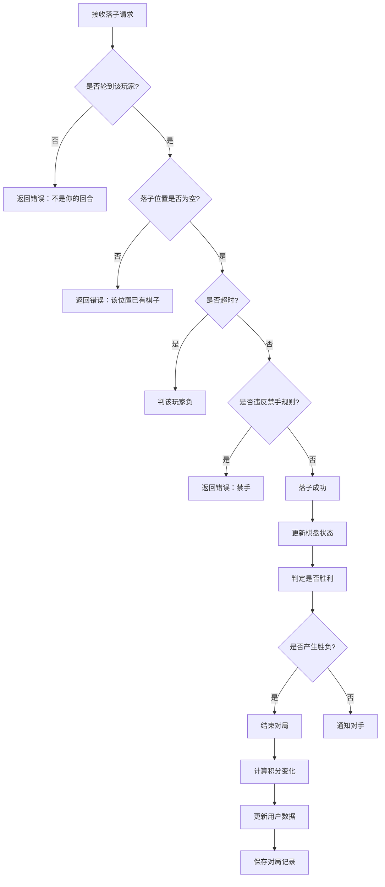
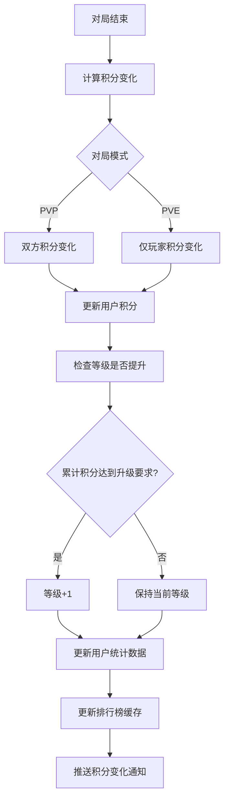
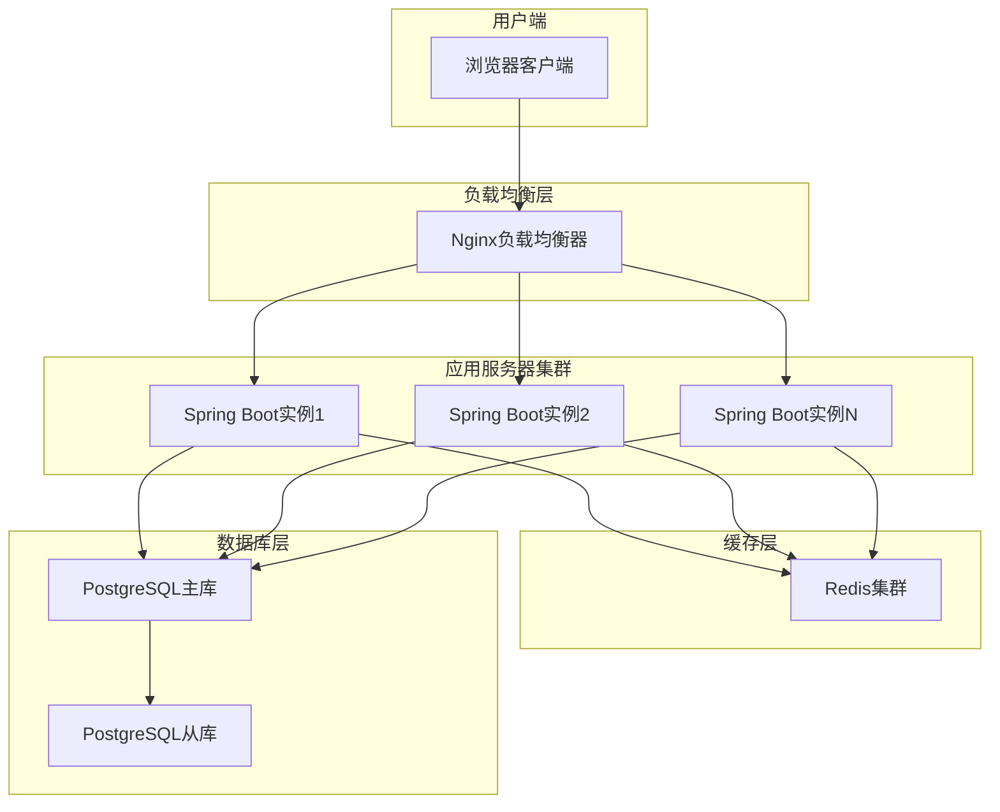

# 五子棋在线对弈平台设计文档

## 1. 项目概述

### 1.1 项目背景
构建一个基于Web的五子棋在线对弈平台，为用户提供在线双人对弈和人机对战两种游戏模式，通过互联网实现随时随地的五子棋对局体验。

### 1.2 核心目标
- 提供流畅的双人在线实时对弈体验
- 提供多难度级别的人机对战功能
- 实现完整的用户成长体系（等级、积分、排行榜）
- 支持按等级匹配的公平对战机制

### 1.3 技术架构
采用前后端分离架构：
- 前端：Vue.js 框架
- 后端：Spring Boot 框架
- 数据库：PostgreSQL
- 实时通信：WebSocket

## 2. 系统架构设计

### 2.1 整体架构

### 2.2 核心模块划分

| 模块名称 | 职责描述 | 关键功能 |
|---------|---------|---------|
| 用户管理模块 | 管理用户注册、登录、个人信息及成长体系 | 注册登录、资料管理、等级积分、成就系统 |
| 匹配服务模块 | 处理玩家匹配逻辑 | 按等级匹配、匹配队列管理、匹配超时处理 |
| 对局管理模块 | 管理对局生命周期和棋局状态 | 棋局创建、落子验证、胜负判定、对局记录 |
| AI引擎模块 | 提供人机对战的AI计算能力 | 多难度AI策略、落子计算、局面评估 |
| 排行榜模块 | 统计和展示玩家排名信息 | 实时排名计算、历史排名、排行榜查询 |
| 实时通信模块 | 处理客户端与服务器的实时双向通信 | WebSocket连接管理、消息推送、心跳检测 |

## 3. 功能设计

### 3.1 用户管理功能

#### 3.1.1 用户注册与登录
- 支持用户名+密码注册
- 支持邮箱验证（可选）
- 登录后生成JWT令牌用于身份认证
- 支持密码找回功能

#### 3.1.2 用户成长体系

**等级系统**
- 用户初始等级为1级
- 通过积分累积提升等级
- 等级影响匹配对手范围

**积分系统**
- 胜利获得积分：基础分+对手等级加成
- 失败扣除积分：基础分-自身等级补偿
- 平局少量积分奖励
- 积分不会低于0

**积分计算规则示例**

| 对局结果 | 积分变化规则 | 说明 |
|---------|-------------|------|
| 胜利 | +10 + (对手等级 - 自己等级) × 2 | 击败高等级对手获得更多积分 |
| 失败 | -5 - (自己等级 - 对手等级) × 1 | 输给低等级对手扣更多积分 |
| 平局 | +2 | 固定积分 |

**等级晋升表**

| 等级 | 所需累计积分 | 等级称号 |
|-----|------------|---------|
| 1 | 0 | 初学者 |
| 2 | 100 | 入门 |
| 3 | 300 | 进阶 |
| 4 | 600 | 熟练 |
| 5 | 1000 | 高手 |
| ... | ... | ... |

### 3.2 游戏模式设计

#### 3.2.1 双人在线对弈模式

**匹配机制**
- 按等级范围匹配：优先匹配±2级范围内的玩家
- 匹配超时扩大范围：等待30秒后扩大到±5级
- 匹配队列管理：使用先进先出队列，确保公平性

**对局流程**

**落子规则**
- 标准15×15棋盘
- 黑棋先手
- 禁手规则：支持标准五子棋禁手（三三、四四、长连禁手）
- 超时判负：每步30秒思考时间，超时判负

#### 3.2.2 人机对战模式

**难度级别设计**

| 难度级别 | AI策略描述 | 目标用户 |
|---------|-----------|---------|
| 简单 | 基于简单规则的防守型AI，主要阻挡玩家连子，较少主动进攻 | 新手玩家 |
| 中等 | 攻守平衡的AI，能识别简单的连子模式并做出应对 | 进阶玩家 |
| 困难 | 使用MinMax算法+Alpha-Beta剪枝，具备中等搜索深度 | 高级玩家 |

**AI决策流程**

**AI评估维度**
- 自身连子数量和形态（活三、冲四、活四等）
- 对手连子威胁等级
- 关键点位价值（中心区域、连接点等）
- 局面控制力

### 3.3 排行榜功能

#### 3.3.1 排行榜类型
- 全服积分排行榜：展示积分最高的前100名玩家
- 胜率排行榜：展示胜率最高的玩家（至少10场对局）
- 等级排行榜：展示等级最高的玩家

#### 3.3.2 排名更新机制
- 实时排名：每局结束后立即更新积分
- 排行榜缓存：使用Redis缓存排行榜数据，每5分钟刷新一次
- 历史排名：保留每日/每周/每月排名快照

### 3.4 对局管理功能

#### 3.4.1 对局状态管理

**对局状态流转**

**对局数据记录**
- 对局基本信息：对局ID、对局模式、开始时间、结束时间
- 玩家信息：双方玩家ID、等级、最终积分变化
- 棋谱数据：完整的落子序列（坐标+时间戳）
- 对局结果：胜负关系、结束原因

#### 3.4.2 断线重连处理
- 玩家断线后保留对局状态60秒
- 60秒内重连可恢复对局
- 超过60秒未重连则判负，对手获胜

## 4. 数据模型设计

### 4.1 核心数据实体

#### 4.1.1 用户表 (user)

| 字段名 | 数据类型 | 说明 | 约束 |
|-------|---------|------|------|
| user_id | BIGINT | 用户唯一标识 | 主键，自增 |
| username | VARCHAR(50) | 用户名 | 唯一，非空 |
| password_hash | VARCHAR(255) | 密码哈希值 | 非空 |
| email | VARCHAR(100) | 邮箱地址 | 唯一 |
| level | INTEGER | 用户等级 | 默认1 |
| score | INTEGER | 当前积分 | 默认0 |
| total_games | INTEGER | 总对局数 | 默认0 |
| win_count | INTEGER | 胜利场数 | 默认0 |
| lose_count | INTEGER | 失败场数 | 默认0 |
| draw_count | INTEGER | 平局场数 | 默认0 |
| created_at | TIMESTAMP | 创建时间 | 非空 |
| updated_at | TIMESTAMP | 更新时间 | 非空 |

#### 4.1.2 对局表 (game)

| 字段名 | 数据类型 | 说明 | 约束 |
|-------|---------|------|------|
| game_id | BIGINT | 对局唯一标识 | 主键，自增 |
| game_mode | VARCHAR(20) | 对局模式 | 枚举：PVP/PVE |
| black_player_id | BIGINT | 黑棋玩家ID | 外键关联user_id |
| white_player_id | BIGINT | 白棋玩家ID | 外键关联user_id，AI对战时为NULL |
| ai_difficulty | VARCHAR(20) | AI难度 | 枚举：EASY/MEDIUM/HARD，PVP时为NULL |
| status | VARCHAR(20) | 对局状态 | 枚举：WAITING/PLAYING/FINISHED |
| winner_id | BIGINT | 获胜者ID | 外键关联user_id，平局时为NULL |
| end_reason | VARCHAR(50) | 结束原因 | 枚举：NORMAL/TIMEOUT/RESIGN/DISCONNECT |
| black_score_change | INTEGER | 黑棋玩家积分变化 | 可为负数 |
| white_score_change | INTEGER | 白棋玩家积分变化 | 可为负数，AI对战时为NULL |
| started_at | TIMESTAMP | 开始时间 | |
| ended_at | TIMESTAMP | 结束时间 | |
| created_at | TIMESTAMP | 创建时间 | 非空 |

#### 4.1.3 棋谱表 (game_move)

| 字段名 | 数据类型 | 说明 | 约束 |
|-------|---------|------|------|
| move_id | BIGINT | 落子记录唯一标识 | 主键，自增 |
| game_id | BIGINT | 所属对局ID | 外键关联game_id，非空 |
| move_number | INTEGER | 落子序号 | 非空，从1开始 |
| player_id | BIGINT | 落子玩家ID | 外键关联user_id |
| position_x | INTEGER | 落子X坐标 | 0-14 |
| position_y | INTEGER | 落子Y坐标 | 0-14 |
| move_time | TIMESTAMP | 落子时间 | 非空 |
| time_used | INTEGER | 本步耗时（秒） | |

#### 4.1.4 排行榜快照表 (ranking_snapshot)

| 字段名 | 数据类型 | 说明 | 约束 |
|-------|---------|------|------|
| snapshot_id | BIGINT | 快照唯一标识 | 主键，自增 |
| user_id | BIGINT | 用户ID | 外键关联user_id，非空 |
| rank | INTEGER | 排名 | 非空 |
| score | INTEGER | 积分 | 非空 |
| level | INTEGER | 等级 | 非空 |
| win_rate | DECIMAL(5,2) | 胜率（百分比） | |
| snapshot_type | VARCHAR(20) | 快照类型 | 枚举：DAILY/WEEKLY/MONTHLY |
| snapshot_date | DATE | 快照日期 | 非空 |
| created_at | TIMESTAMP | 创建时间 | 非空 |

### 4.2 数据关系图

## 5. 接口设计

### 5.1 RESTful API接口

#### 5.1.1 用户管理接口

| 接口路径 | 请求方法 | 功能描述 | 认证要求 |
|---------|---------|---------|---------|
| /api/user/register | POST | 用户注册 | 否 |
| /api/user/login | POST | 用户登录 | 否 |
| /api/user/profile | GET | 获取用户信息 | 是 |
| /api/user/profile | PUT | 更新用户信息 | 是 |
| /api/user/stats | GET | 获取用户统计数据 | 是 |

#### 5.1.2 匹配服务接口

| 接口路径 | 请求方法 | 功能描述 | 认证要求 |
|---------|---------|---------|---------|
| /api/match/start | POST | 开始匹配 | 是 |
| /api/match/cancel | POST | 取消匹配 | 是 |
| /api/match/status | GET | 查询匹配状态 | 是 |

#### 5.1.3 对局管理接口

| 接口路径 | 请求方法 | 功能描述 | 认证要求 |
|---------|---------|---------|---------|
| /api/game/create | POST | 创建人机对战 | 是 |
| /api/game/{gameId} | GET | 获取对局详情 | 是 |
| /api/game/{gameId}/resign | POST | 认输 | 是 |
| /api/game/history | GET | 获取历史对局列表 | 是 |
| /api/game/{gameId}/moves | GET | 获取棋谱数据 | 是 |

#### 5.1.4 排行榜接口

| 接口路径 | 请求方法 | 功能描述 | 认证要求 |
|---------|---------|---------|---------|
| /api/ranking/score | GET | 获取积分排行榜 | 否 |
| /api/ranking/winrate | GET | 获取胜率排行榜 | 否 |
| /api/ranking/level | GET | 获取等级排行榜 | 否 |
| /api/ranking/my | GET | 获取我的排名信息 | 是 |

### 5.2 WebSocket通信协议

#### 5.2.1 连接与认证
- 连接地址：`ws://{domain}/ws/game`
- 连接时携带JWT令牌进行身份认证
- 连接成功后服务器返回连接确认消息

#### 5.2.2 消息格式

所有WebSocket消息采用统一的JSON格式：

| 字段名 | 类型 | 说明 |
|-------|------|------|
| type | String | 消息类型 |
| gameId | Long | 对局ID（部分消息需要） |
| data | Object | 消息数据体 |
| timestamp | Long | 消息时间戳 |

#### 5.2.3 消息类型定义

**客户端发送的消息类型**

| 消息类型 | 说明 | 数据结构 |
|---------|------|---------|
| MOVE | 落子操作 | {x: Integer, y: Integer} |
| RESIGN | 认输 | {} |
| HEARTBEAT | 心跳 | {} |

**服务器推送的消息类型**

| 消息类型 | 说明 | 数据结构 |
|---------|------|---------|
| GAME_START | 对局开始 | {gameId, blackPlayerId, whitePlayerId, myColor} |
| MOVE_SUCCESS | 落子成功 | {x, y, playerId, nextTurn} |
| MOVE_INVALID | 落子非法 | {reason} |
| OPPONENT_MOVE | 对手落子 | {x, y, nextTurn} |
| GAME_OVER | 对局结束 | {winnerId, reason, scoreChange} |
| OPPONENT_RESIGN | 对手认输 | {winnerId} |
| OPPONENT_DISCONNECT | 对手断线 | {remainingTime} |
| HEARTBEAT_ACK | 心跳响应 | {} |

### 5.3 接口调用时序

#### 5.3.1 双人对弈完整流程

## 6. 核心业务流程

### 6.1 匹配流程

### 6.2 落子验证流程

### 6.3 胜负判定逻辑

**判定时机**
- 每次落子后立即进行判定
- 判定范围：以最新落子点为中心的四个方向（横、竖、左斜、右斜）

**判定规则**
- 连续五个同色棋子则该方获胜
- 超过五个连子（长连）：黑棋判负，白棋获胜
- 黑棋形成三三、四四禁手：黑棋判负
- 棋盘下满无胜负：平局

**四个判定方向**
- 水平方向：检查左右共9个位置（落子点±4格）
- 垂直方向：检查上下共9个位置
- 左斜方向：左上到右下共9个位置
- 右斜方向：右上到左下共9个位置

### 6.4 积分与等级更新流程

## 7. 非功能性设计

### 7.1 性能要求

| 性能指标 | 目标值 | 说明 |
|---------|-------|------|
| 响应时间 | REST API ≤ 200ms，WebSocket消息延迟 ≤ 100ms | 保证流畅的用户体验 |
| 并发对局数 | ≥ 5000局 | 支持1万名玩家同时在线对弈 |
| 数据库查询响应 | ≤ 50ms | 通过索引优化和缓存实现 |
| AI计算时间 | 简单≤100ms，中等≤500ms，困难≤2000ms | 保证人机对战的响应速度 |

### 7.2 安全设计

#### 7.2.1 身份认证
- 使用JWT令牌进行身份认证
- 令牌有效期为24小时
- 敏感操作需要验证令牌的有效性

#### 7.2.2 密码安全
- 使用BCrypt算法对密码进行哈希存储
- 密码强度要求：至少8位，包含字母和数字

#### 7.2.3 通信安全
- 生产环境使用HTTPS和WSS协议
- 敏感数据传输加密

#### 7.2.4 防作弊机制
- 落子合法性服务端验证
- 超时检测防止恶意拖延
- 异常落子频率检测
- 人机对战AI计算在服务端进行

### 7.3 可用性设计

#### 7.3.1 断线重连
- 玩家断线后保留对局状态60秒
- 重连后恢复完整棋盘状态和剩余时间
- 超时未重连自动判负

#### 7.3.2 异常处理
- 服务异常时向客户端返回明确的错误信息
- 数据库事务保证数据一致性
- 关键操作失败后自动重试机制

#### 7.3.3 降级策略
- 排行榜服务异常时返回缓存数据
- 匹配服务高负载时限制新匹配请求
- AI服务异常时降级到简单难度

### 7.4 可扩展性设计

#### 7.4.1 水平扩展
- 应用服务无状态设计，支持多实例部署
- WebSocket服务通过Redis实现会话共享
- 数据库支持读写分离和分库分表

#### 7.4.2 功能扩展预留
- 预留观战功能接口
- 预留好友系统接口
- 预留聊天功能接口
- 预留房间对战功能接口

### 7.5 可维护性设计

#### 7.5.1 日志记录
- 记录所有API请求和响应
- 记录对局关键事件（开始、结束、异常）
- 记录异常和错误堆栈信息

#### 7.5.2 监控指标
- 系统负载监控（CPU、内存、网络）
- 业务指标监控（在线人数、对局数、匹配成功率）
- 错误率监控和告警

## 8. 部署架构

### 8.1 部署拓扑

### 8.2 环境划分

| 环境类型 | 用途 | 配置要求 |
|---------|------|---------|
| 开发环境 | 本地开发和调试 | 单机部署，最小配置 |
| 测试环境 | 功能测试和集成测试 | 模拟生产环境，中等配置 |
| 生产环境 | 正式对外服务 | 高可用集群部署，高配置 |

### 8.3 数据备份策略

- 数据库每日全量备份
- 每小时增量备份
- 备份数据保留30天
- 定期进行恢复演练

## 9. 技术实现要点

### 9.1 前端技术要点

**核心技术栈**
- Vue 3：采用Composition API构建组件
- Vue Router：实现单页应用路由
- Pinia：状态管理
- WebSocket客户端：实现实时通信

**关键功能实现**
- 棋盘组件：使用Canvas或SVG渲染棋盘和棋子
- 落子动画：提供视觉反馈
- 倒计时组件：显示剩余思考时间
- 实时消息处理：WebSocket消息的接收和派发

### 9.2 后端技术要点

**核心技术栈**
- Spring Boot：应用框架
- Spring Security + JWT：身份认证和授权
- Spring WebSocket：WebSocket支持
- MyBatis/JPA：数据持久化

**关键功能实现**
- WebSocket会话管理：维护玩家连接状态
- 匹配队列：使用Redis实现分布式匹配队列
- 胜负判定算法：高效的连子检测算法
- AI引擎：MinMax算法实现

### 9.3 数据库技术要点

**索引设计**
- 用户表：username、email建立唯一索引
- 对局表：black_player_id、white_player_id、status建立索引
- 棋谱表：game_id建立索引，(game_id, move_number)建立复合索引
- 排行榜快照表：(snapshot_type, snapshot_date, rank)建立复合索引

**查询优化**
- 排行榜查询使用Redis缓存
- 历史对局查询支持分页
- 统计数据定期预计算

### 9.4 缓存策略

**Redis使用场景**

| 缓存键 | 数据类型 | 过期时间 | 用途 |
|-------|---------|---------|------|
| ranking:score | Sorted Set | 5分钟 | 积分排行榜 |
| ranking:winrate | Sorted Set | 5分钟 | 胜率排行榜 |
| game:{gameId}:board | Hash | 对局结束后删除 | 对局棋盘状态 |
| match:queue:{level} | List | 无 | 匹配队列 |
| user:{userId}:session | String | 24小时 | 用户会话 |
| ws:session:{userId} | String | 连接断开后删除 | WebSocket会话映射 |

## 10. 项目里程碑

### 10.1 开发阶段划分

| 阶段 | 主要任务 | 预期交付 |
|-----|---------|---------|
| 第一阶段 | 基础框架搭建、用户系统、数据库设计 | 用户注册登录功能、数据库表结构 |
| 第二阶段 | 对局核心逻辑、棋盘UI、胜负判定 | 基本的棋盘对弈功能（无联网） |
| 第三阶段 | WebSocket通信、双人在线对弈、匹配系统 | 完整的在线对弈功能 |
| 第四阶段 | AI引擎开发、人机对战功能 | 多难度人机对战 |
| 第五阶段 | 等级积分系统、排行榜功能 | 完整的用户成长体系 |
| 第六阶段 | 性能优化、安全加固、测试 | 稳定可发布版本 |

### 10.2 质量保证

**测试策略**
- 单元测试：核心业务逻辑测试覆盖率≥80%
- 集成测试：API接口测试、WebSocket通信测试
- 性能测试：压力测试、并发测试
- 安全测试：漏洞扫描、渗透测试

**代码质量**
- 统一的代码规范和格式化
- 代码审查机制
- 持续集成和自动化测试

## 11. 风险与应对

### 11.1 技术风险

| 风险项 | 影响 | 应对措施 |
|-------|------|---------|
| WebSocket连接稳定性 | 对局中断，用户体验差 | 实现断线重连机制，心跳检测 |
| 高并发下性能瓶颈 | 系统响应慢，延迟高 | 引入缓存、负载均衡、数据库优化 |
| AI计算性能不足 | 人机对战响应慢 | 算法优化、限制搜索深度、异步计算 |
| 数据一致性问题 | 积分、排名数据错误 | 使用事务、分布式锁、定期校验 |

### 11.2 业务风险

| 风险项 | 影响 | 应对措施 |
|-------|------|---------|
| 作弊行为 | 破坏游戏公平性 | 服务端验证、异常检测、封禁机制 |
| 匹配时间过长 | 用户流失 | 动态调整匹配范围、引入机器人 |
| 用户恶意断线 | 影响对手体验 | 超时判负、信用分机制 |

## 12. 未来扩展方向

### 12.1 功能扩展
- 好友系统：添加好友、好友对战
- 房间对战：创建房间、邀请好友、观战功能
- 对局回放：查看历史对局棋谱回放
- 聊天功能：对局中文字聊天、表情互动
- 锦标赛模式：定期举办线上比赛

### 12.2 技术优化
- 引入微服务架构，服务拆分
- 使用消息队列处理异步任务
- 引入AI模型训练，提升AI水平
- 移动端适配或开发独立APP- 引入AI模型训练，提升AI水平
- 移动端适配或开发独立APP